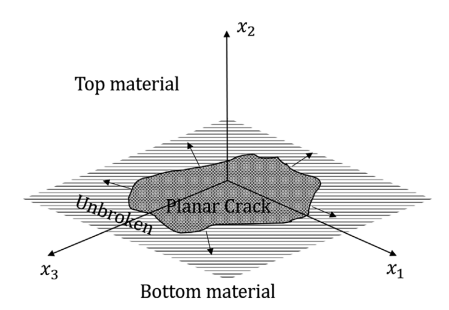

Formulation
##########################

.. _fault_plane-fig:

   A three-dimensional rupture propagation in a plane.
   
   
Consider a 3D fracture plane as given shown in :numref:`Fig. %s <fault_plane-fig>`. The elastodynamic equations at the interface between two dissimilar elastic half-spaces is given as follows (`Kostrov, 1966 <https://doi.org/10.1016/0021-8928(66)90087-6>`_; `Gupta and Ranjith, 2024 <https://dx.doi.org/10.1002/nag.3632>`_):
  
.. math::
   A_{ij}(\tau_{i}(x_1,x_3,t)-\tau_{i}^0(x_1,x_3,t))+ \dot{\delta}_i(x_1,x_3,t) = f_i (x_1,x_3,t)

where,  :math:`x_i` is a Cartesian coordinate system, with :math:`x_1-x_3` plane being the plane of interface and time :math:`t`.  :math:`\left[A_{ij} \right]` is a diagonal matrix with :math:`A_{11} = A_{33} = \frac{c_s^+}{\mu^+}`, :math:`A_{22} = \frac{c_d^+}{\lambda^+ + 2 \mu^+}+\frac{c_d^-}{\lambda^- + 2 \mu^-}`. :math:`\tau_{i}`'s are the traction components at the interface with stresses at the interface being :math:`\tau_{i}(x_1,x_3,t)= \sigma_{i2}(x_1,x_2^{\pm},x_3,t)`. :math:`\dot{\delta}_i` is the rate of discontinuity at the interface with :math:`\delta_i` given in terms of displacements :math:`u_i` of the two half-spaces as :math:`\delta_i = u_i^+ - u_i^-`.  The superscripts “:math:`\pm`” refer to field quantities corresponding to the top and lower half-space, respectively. :math:`\lambda` and :math:`\mu` are the Lame\'s parameters. The shear and dilatational wave speeds are given by :math:`c_s = \sqrt{\mu/\rho}` and :math:`c_d = \sqrt{(\lambda +2\mu )/\rho}`, respectively, with :math:`\rho` being the density of the elastic half-space. The functionals :math:`f_i`'s involve the spatio-temporal convolutions of traction components at the interface.

Spectral BIEM
*******************
In spectral BIEM, the field quantities traction and slip (displacement discontinuities) at the interface are taken in spectral form as:

.. math::

    \begin{Bmatrix}
    \tau_j(x_1,x_3,t) \\
    \delta_j(x_1,x_3,t) \\
    \end{Bmatrix}
    =
    \begin{Bmatrix}
    T_j(t;k,m) \\
    D_j(t;k,m) \\
    \end{Bmatrix}
    e^{i(kx_1+mx_3)},
    
where :math:`k` and :math:`m` are wave numbers in :math:`x_1` - and :math:`x_3` - directions. Let, :math:`q = (k , m)` is a two-dimensional wave vector, with a magnitude :math:`q=\sqrt{k^2 + m^2}`.     

We get the 3D Spectral BIEM relations (see. Eq. 19 in `Gupta and Ranjith, 2024 <https://dx.doi.org/10.1002/nag.3632>`_) at the interface of two dissimilar half-spaces as:

.. math::

    \begin{bmatrix}
    \frac{c_s^+}{\mu^+} \eta T_1 \left( t; k, m \right) + \frac{\partial D_1\left(t; k, m \right)}{\partial t} \\
    \frac{c_s^+}{\mu^+} \xi T_2 \left( t; k, m \right) + \frac{\partial D_2\left(t; k, m \right)}{\partial t} \\
    \frac{c_s^+}{\mu^+} \eta T_3 \left( t; k, m \right) + \frac{\partial D_3\left(t; k, m \right)}{\partial t}
    \end{bmatrix}
    =
    \begin{bmatrix}
    F_1 \left( t; k, m \right) \\
    F_2 \left( t; k, m \right) \\
    F_3 \left( t; k, m \right)
    \end{bmatrix}

where, :math:`\eta = \left( 1+ \frac{c_s^-}{c_s^+}\frac{\mu^+}{\mu^-}\right)` and :math:`\xi = \left( \frac{c_s^+}{c_d^-} + \frac{c_s^-}{c_s^+}\frac{\mu^+}{\mu^-}\frac{c_s^-}{c_d^-}\right)`, and the convolution terms are given by

.. math::
   \begin{Bmatrix}
   F_1 \left( t; k, m \right) \\
    F_2 \left( t; k, m \right) \\
    F_3 \left( t; k, m \right)
   \end{Bmatrix} = \int_0^t 
    \begin{bmatrix}
        C_{11} \left( t'; q \right) & C_{12} \left( t'; q \right) & C_{13} \left( t'; q \right) \\
        C_{21} \left( t'; q \right) & C_{22} \left( t'; q \right) & C_{23} \left( t'; q \right) \\
        C_{31} \left( t'; q \right) & C_{32} \left( t'; q \right) & C_{33} \left( t'; q \right)
    \end{bmatrix}
    \begin{bmatrix}
        T_1 \left( t - t'; k, m \right) \\
        T_2 \left( t - t'; k, m \right) \\
        T_3 \left( t - t'; k, m \right)
    \end{bmatrix} dt'

In the above equation, we have five independent convolution kernels which can be expressed as

.. math::

    C_{11} (t; q) = \frac{1}{q^2} [k^2 (M_{11}^+ + M_{11}^-) + m^2 (M_{33}^+ + M_{33}^-)]
    \\
    C_{22}(t; q) = M_{22}^+ + M_{22}^-
    \\
    C_{33}(t; q) = \frac{1}{q^2} [m^2 (M_{11}^+ + M_{11}^-) + k^2 (M_{33}^+ + M_{33}^-)]
    \\
    C_{12}(t; q) = \frac{k}{m} C_{22}(t; q) = -\frac{m}{k} C_{33}(t; q) = -C_{21}(t; q) = \frac{k}{q^2} [M_{12}^+ - M_{12}^-]
    \\
    C_{13}(t; q) = C_{31}(t; q) = \frac{km}{q^2} [ (M_{11}^+ + M_{11}^-) - (M_{33}^+ + M_{33}^-) ]

All above convolution kernels :math:`\left( C_{ij}(t; q) \right)` can be expressed in closed form. The convolution kernels :math:`M_{11}(t; q), M_{12}(t; q), M_{22}(t; q)` and :math:`M_{33}(t; q)` can be written as in the Appendix of `Gupta and Ranjith, 2024 <https://dx.doi.org/10.1002/nag.3632>`_):

.. math::

    \begin{split}
    M_{11}(t; q) =& c_s \frac{c_s}{\mu} |q| \Bigg\lbrace 
    - \int_0^1 \frac{g(y) - g(y_R)}{y - y_R} y \sin(|q| c_s t) \, dy \\
    & + g(y_R) \Bigg[y_R \sin(|q| c_R t) \int_{|q|c_s t - |q|c_R t}^{|q|c_s t + |q|c_R t} \cos \theta \, d\theta 
    - y_R \cos(|q|c_R t) \int_{-|q|c_R t}^{|q|c_R t} \sin\theta \, d\theta
    \Bigg] \\
    & + g(y_R) \frac{\cos(|q|c_s t) - 1}{|q| c_s t} \frac{2}{\pi}
    \int_1^a \frac{4(1-y^2)\sqrt{1-y^2/a^2}}{(y^2 - y_R^2)(y^2-y_1^2)(y^2-y_2^2)} y \sin(|q|c_s t) \, dy
    \Bigg\rbrace
    \end{split}

    

.. math::

    \begin{split}
    M_{22}(t; q) =& c_s \frac{c_s}{\mu} |q| \Bigg\lbrace  
    - \int_0^1 \frac{f(y) - f(y_R)}{y - y_R} y \sin(|q| c_s t) \, dy \\
    & + f(y_R) \Bigg[
    y_R \sin(|q| c_R t) \int_{|q|c_s t - |q|c_R t}^{|q|c_s t + |q|c_R t} \cos \theta \, d\theta 
    - y_R \cos(|q|c_R t) \int_{-|q|c_R t}^{|q|c_R t} \sin\theta \, d\theta
    \Bigg] \\
    & + f(y_R) \frac{\cos(|q|c_s t) - 1}{|q| c_s t} \frac{2}{\pi}
    \int_1^a \frac{(2-y^2)\sqrt{1-y^2/a^2}}{(y^2 - y_R^2)(y^2-y_1^2)(y^2-y_2^2)} y \sin(|q|c_s t) \, dy
    \Bigg\rbrace
    \end{split}
    

.. math::

    \begin{split}
    M_{12}(t; q) =& -iq c_s \frac{c_s}{\mu} \frac{2}{\pi} \int_1^a
    \Bigg[
    \frac{2y\sqrt{2 - 1 - y^2 / a^2}(2-y^2)}{(y_R^2 - y^2)(y_1^2 - y^2)(y_2^2 - y^2)}
    \cos(y|q|c_s t) \\
    & + \frac{-8y_R^2/a^2 + 8/a^2 - y_R^4 + 4 + 6y_R^2 + 2\sqrt{1-y_R^2/a^2}(2-y_R^2)}{(y_1^2 - y_R^2)(y_2^2 - y_R^2)} \cos(|q|c_R t)
    \Bigg]
    \end{split}

.. math::
    M_{33}(t; q) = c_s \frac{c_s}{\mu} 
    J_1(|q|c_s t)
    

with

.. math::
    g(y) = \frac{2}{\pi} \frac{4\,(1-y^2)\, \sqrt{1-y^2/a^2} + (2-y^2)^2 \sqrt{1-y^2}}{(y + y_R) \, (y^2 - y_1^2)\, (y^2 - y_2^2)}

.. math::
    f(y) = \frac{2}{\pi} \frac{4\,(1-y^2/a^2)\, \sqrt{1-y^2} + (2-y^2)^2 \sqrt{1-y^2/a^2}}{(y + y_R) \, (y^2 - y_1^2)\, (y^2 - y_2^2)}

where :math:`s = p / \|q\| c_s, a = c_d / c_s`, and :math:`y_R = c_R / c_s`. :math:`c_R` is the Rayleigh wave speed.

.. Note that, in the current scheme, all the kernels are obtained as a closed-form solution at the interface. The formulation for these kernels can be found in \cite{Gupta2024Spectral}. 

Interface Law
****************************
We have incorporated the classical linear friction slip-weakening law in the code. The frictional coefficients are vectorized over the fault plane so that one can analyze the effect of local heterogeneities. One can look into the `main.cuf` in the `./src` directory to add more frcitional law as an when necessary.

Linear Slip-Weakening law
-----------------------------------
The linear slip-weakening friction law is as follows:

.. math::
    \tau_2^{*}(\delta) = \tau_2 \begin{cases}
        \mu_s -(\mu_s - \mu_r) \frac{\delta}{\delta_{c}}, & \text{if $\delta < \delta_c$}\\
            \mu_r, & \text{otherwise}
    \end{cases}
    
    
where, :math:`\tau_2^{*}` is the effective shear strength of fault plane, :math:`\delta=\sqrt{(\delta_1^2 + \delta_3^2)}` is the effective slip, and :math:`\delta_{c}` is the critical slip-weakening distance. :math:`\mu_s` and :math:`\mu_r` are the static and residual frictional coefficients, respectively.
   
 